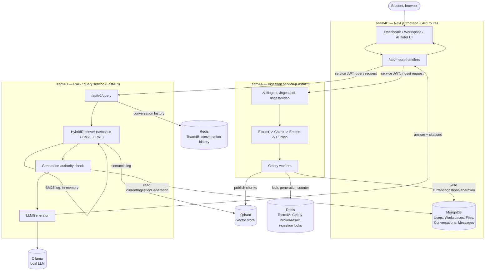

# Architecture

EduCopilot is split into three independently-runnable services plus shared
infrastructure. This document explains how they fit together. Service-specific
detail lives in [TEAM4A.md](TEAM4A.md), [TEAM4B.md](TEAM4B.md), and
[TEAM4C.md](TEAM4C.md); the exact request/response contracts between them are
in [INTEGRATION.md](INTEGRATION.md).

## System diagram

## Service responsibilities

| Service | Owns | Does not own |
|---|---|---|
| **Team4A** | PDF/YouTube ingestion, text extraction, chunking, embedding generation, publishing chunks to Qdrant, the ingestion-generation/authority record | Retrieval, generation, the user-facing product, auth |
| **Team4B** | Hybrid retrieval (semantic + BM25 + RRF), the generation-authority *check* (reads what Team4A wrote), LLM prompt construction and generation, citation assembly, conversation history, prompt-injection defenses | Ingestion, the user-facing product, auth, MongoDB's User/Workspace/File schemas (it only reads one narrow field) |
| **Team4C** | The Next.js frontend, authentication, workspace/material CRUD, the MongoDB schemas for product data (Users, Workspaces, Files, Conversations, Messages), calling Team4A/Team4B as a client, rendering answers and citations | Retrieval logic, generation logic, embeddings, chunking |

Team4A and Team4B never call each other directly, and neither one is aware of
Team4C's UI. All three communicate only through the contracts in
[INTEGRATION.md](INTEGRATION.md) — internal service JWTs for
Team4C→Team4A/4B, and a narrow, explicitly-scoped MongoDB field
(`File.currentIngestionGeneration`) that both Team4A (writer) and Team4B
(reader) touch without either one owning the `File` schema itself.

## Data flow: ingestion

1. A student uploads a PDF or submits a YouTube URL in Team4C's UI.
2. Team4C's API route creates a `File` document in MongoDB (`status: "uploading"`),
   then calls Team4A's `/v1/ingest` (or `/ingest/pdf` / `/ingest/video`) with a
   fresh internal service JWT (`scope: "ingest"`, `aud: "team4a-ingestion"`).
3. Team4A's pipeline extracts text (PDF: PyMuPDF; YouTube: transcript API,
   with a Hindi fallback if the default-language transcript is unavailable),
   chunks it, generates embeddings (`all-MiniLM-L6-v2`), and publishes the
   chunks to Qdrant under the canonical collection, tagged with
   `workspace_id`, `document_id`, and `ingestion_generation`.
4. On completion, Team4A's Mongo-authority client writes
   `currentIngestionGeneration` and `ingestionId` onto the **same** `File`
   document Team4C created — a narrow, explicitly-scoped write (Team4A does
   not own or otherwise touch the `File` schema).
5. Team4C polls/refreshes and shows the material as `Ready`.

Full detail, including the Redis lock and generation-numbering mechanism that
makes concurrent/repeat ingestion safe: [INTEGRATION.md](INTEGRATION.md) and
[TEAM4A.md](TEAM4A.md).

## Data flow: a chat question

1. The student asks a question in the AI Tutor panel.
2. Team4C's `/api/chat` route resolves the conversation's stable
   `ragSessionId`, the effective document scope (workspace-wide or a
   specific material), and calls Team4B's `/api/v1/query` with a fresh
   internal service JWT (`scope: "query"`, `aud: "team4b-query"`).
3. Team4B's `HybridRetriever` runs the semantic leg (Qdrant cosine
   similarity) and the BM25 leg (an in-memory index rebuilt per workspace
   per query) in parallel, merges them with Reciprocal Rank Fusion, and
   applies the generation-authority filter (a MongoDB read of
   `currentIngestionGeneration`) before fusion, not after — a stale chunk
   can never reach the LLM.
4. `LLMGenerator` builds a prompt (system instructions + untrusted-context-delimited
   evidence + conversation history + the question) and calls Ollama.
   A deterministic output-side guard checks the answer before it's returned
   (see [TEAM4B.md](TEAM4B.md) and `docs/SECURITY_ARCHITECTURE.md`).
5. Team4B returns the answer plus structured source attributions. Team4C
   re-filters those attributions against the *actual* files in the
   authenticated user's workspace (defense-in-depth — it never trusts
   Team4B's attributions as automatically safe to render), persists both
   turns to MongoDB, and streams the answer to the browser.

Full detail: [INTEGRATION.md](INTEGRATION.md).

## Isolation model

Every retrieval call is scoped by `workspace_id` before any ranking happens
— there is no "search everything" code path in Team4B. Team4C independently
enforces workspace *ownership* (a user can only act on workspaces they own)
before ever constructing a request to Team4A or Team4B. These are two
separate, independently-enforced boundaries: Team4C's ownership check
answers "is this the right user's workspace?"; Team4B's `workspace_id`
scoping answers "does this chunk belong to the workspace being queried?".
Neither depends on the other to be correct.

## Authentication and service identity

- **Human ↔ Team4C**: Auth.js (NextAuth v5), credentials provider, session
  cookie. See [TEAM4C.md](TEAM4C.md).
- **Team4C ↔ Team4A/Team4B**: short-lived (default 300s), ES256-signed
  internal service JWTs, minted server-side by Team4C from
  server-verified identity (never a client-supplied value) immediately
  before each call. Team4A/Team4B each hold only the corresponding
  *public* verification key — Team4C is the only service holding the
  private signing key. See [INTEGRATION.md](INTEGRATION.md).

## Storage

| Store | What lives there | Owned by |
|---|---|---|
| **MongoDB** | Users, Workspaces, Files (incl. `currentIngestionGeneration`), Conversations, Messages | Team4C's schema; Team4A writes one narrow field on `File` |
| **Qdrant** | Chunk vectors + payload (text, `workspace_id`, `document_id`, `ingestion_generation`, page/timestamp metadata) | Team4A publishes; Team4B reads |
| **Redis (Team4A, port 6379)** | Celery broker/result backend, per-document ingestion locks, ingestion-generation counters | Team4A |
| **Redis (Team4B, port 6380)** | Conversation history, keyed by `ragSessionId` | Team4B |
| **Ollama** | The local LLM (`llama3`) generation happens against | Team4B calls it; nothing is stored there beyond the model weights |

Why not store embeddings in MongoDB: Qdrant is a purpose-built vector index
(approximate-nearest-neighbor search, `on_disk_payload`, HNSW indexing) —
MongoDB has no comparable native vector-search capability in this
deployment, and mixing a vector index into the same store as transactional
product data would couple two very different scaling/access patterns.

## Why three services instead of one

The system was built as three independently-developed, independently-testable
services (a common structure for a multi-team academic/capstone project) so
that ingestion, retrieval/generation, and the product UI could each be
built, tested, and iterated on without one team's changes breaking another's
working code. The cost is the integration surface documented in
[INTEGRATION.md](INTEGRATION.md) (service JWTs, the generation-authority
handoff); the benefit is that Team4B's RAG pipeline, in particular, was
validated and frozen (see [RAG_ARCHITECTURE.md](RAG_ARCHITECTURE.md)) without
ever needing Team4C's UI to be finished, and Team4C's UI was extensively
polished and tested without ever needing to modify Team4A or Team4B.

## Further reading

- [RAG_ARCHITECTURE.md](RAG_ARCHITECTURE.md) — Team4B's frozen retrieval/generation pipeline in full detail, including every alternative investigated and rejected.
- [SECURITY_ARCHITECTURE.md](SECURITY_ARCHITECTURE.md) — the prompt-injection threat model and defenses.
- [KNOWN_LIMITATIONS.md](KNOWN_LIMITATIONS.md) — real, evidence-backed limitations (multilingual retrieval, generation behavior, performance).
- [INTEGRATION.md](INTEGRATION.md) — the exact service-to-service contracts and lifecycle walkthroughs.
